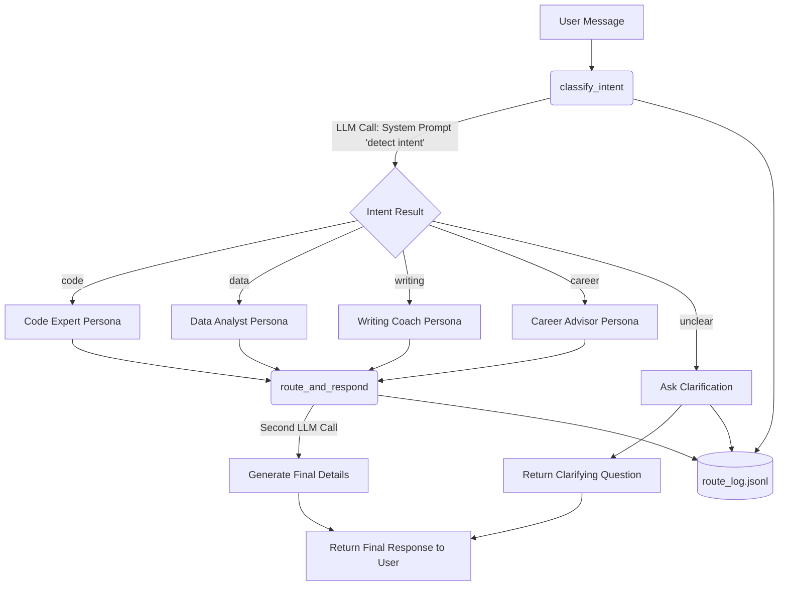

# LLM-Powered Prompt Router for Intent Classification


This Node.js service intelligently routes user requests to specialized AI personas by classifying the user's intent. It is designed to demonstrate key patterns in production AI systems, avoiding single monolithic prompts in favor of specialized expert system prompts.

## Architecture Diagram



## Features & Requirements Met

1. **Configurable Expert Prompts**: Prompts are loaded from an external `prompts.json` file. Four personas are implemented: `code`, `data`, `writing`, and `career`.
2. **Robust Intent Classification**: `classify_intent` uses a lightweight prompt with `response_format: { type: "json_object" }` to reliably return a JSON object (e.g. `{ "intent": "code", "confidence": 0.95 }`).
3. **Smart Routing System**: `route_and_respond` selects the correct persona system prompt based on the label, executing a second generated response using the OpenAI API.
4. **Fallback Handling for 'Unclear' Intents**: When the router cannot boldly classify an intent (`unclear`), the system politely asks for clarification instead of guessing or routing to a default.
5. **Request Logging**: Every classification and final response is logged to `route_log.jsonl` in JSON Lines format to fulfill the observability constraint.
6. **Graceful Error Handling**: `classify_intent` handles malformed or non-JSON responses by defaulting gracefully to `intent: "unclear"` and `confidence: 0.0`. It does not crash.

## Getting Started

1. Ensure you have Node.js 18+ installed.
2. Install the required dependencies:
   ```bash
   npm install
   ```
3. Set your OpenAI API key. Create a `.env` file in the root directory (where `index.js` is) with the following content:
   ```env
   OPENAI_API_KEY=your_openai_api_key_here
   ```
4. Run the project tests:
   ```bash
   npm start
   ```
   Or run it directly via node:
   ```bash
   node index.js
   ```

## Included Tests
The provided `index.js` includes a testing suite simulating 15 messages (including ambiguous commands, coding prompts, typos, and career advice). Running `npm start` will process all 15 sequentially and log them automatically to `route_log.jsonl`.
